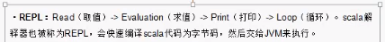

Scala解释器的使用：

​	REPL

​	计算表达式：

​	内置变量：

​	自动补全：

​	

-----

声明变量：

 * 声明Val变量，通常使用val变量，避免被错误修改
   	* 在java大型复杂系统的涉及和开发中，可以使用类似的特性，为了避免被修改，需要设计成不可变类（immutable class），在里面也会使用java的常量进行定义，比如final，阻止变量的值被修改。
	* 声明var变量
	* 指定类型：无论为val或者var变量，都可以手动指定变量类型，如果不指定变量，scala会自动匹配变量类型
	* 声明多个变量：可以多个变量放一起进行声明。

---

数据类型和操作符

基本数据类型：Byte,Char,Short,Int,Long,Float,Double,Boolean

scala不存在包装类型

类型的加强版类型：scala使用很多加强类给数据类型加了增强的功能和函数

基本操作符：

不同于java，不存在+=，引入scala.math()

apply函数

