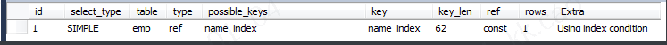
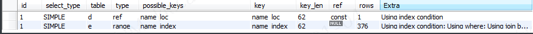

## 					MySQL Explain 详解

​	在日常工作中，我们会有时会开慢查询去记录一些执行时间比较久的 SQL 语句，找出这些 SQL 语句并不意味着完事了，些时我们常常用到 explain 这个命令来查看一个这些 SQL 语句的执行计划，查看该 SQL 语句有没有使用上了索引，有没有做全表扫描，这都可以通过 explain 命令来查看。所以我们深入了解 MySQL 的基于开销的优化器，还可以获得很多可能被优化器考虑到的访问策略的细节，以及当运行 SQL 语句时哪种策略预计会被优化器采用。

```mysql
-- 实际SQL，查找用户名为Jefabc的员工
select * from emp where name = 'Jefabc';
-- 查看SQL是否使用索引，前面加上explain即可
explain select * from emp where name = 'Jefabc';
```

											
expain 出来的信息有 10 列，分别是 id、select_type、table、type、possible_keys、key、key_len、ref、rows、Extra

**概要描述：**  	
**id: 选择标识符** 
**select_type: 表示查询的类型**。 
**table: 输出结果集的表** 
partitions: 匹配的分区 
**type: 表示表的连接类型** 
possible_keys: 表示查询时，可能使用的索引 
**key: 表示实际使用的索引** 
key_len: 索引字段的长度 
**ref: 列与索引的比较** 
rows: 扫描出的行数 (估算的行数) 
filtered: 按表条件过滤的行百分比 
**Extra: 执行情况的描述和说明**

**下面对这些字段出现的可能进行解释：**

### 一、id

SELECT 识别符。这是 SELECT 的查询序列号

**我的理解是 SQL 执行的顺序的标识，SQL 从大到小的执行**

1. id 相同时，执行顺序由上至下

2. 如果是子查询，id 的序号会递增，id 值越大优先级越高，越先被执行

3. id 如果相同，可以认为是一组，从上往下顺序执行；在所有组中，id 值越大，优先级越高，越先执行

```
-- 查看在研发部并且名字以Jef开头的员工，经典查询
explain select e.no, e.name from emp e left join dept d on e.dept_no = d.no where e.name like 'Jef%' and d.name = '研发部';
```
	

### 二、select_type

 表示查询中每个 select 子句的类型

(1) SIMPLE(简单 SELECT，不使用 UNION 或子查询等)

(2) PRIMARY(子查询中最外层查询，查询中若包含任何复杂的子部分，最外层的 select 被标记为 PRIMARY)

(3) UNION(UNION 中的第二个或后面的 SELECT 语句)

(4) DEPENDENT UNION(UNION 中的第二个或后面的 SELECT 语句，取决于外面的查询)

(5) UNION RESULT(UNION 的结果，union 语句中第二个 select 开始后面所有 select)

(6) SUBQUERY(子查询中的第一个 SELECT，结果不依赖于外部查询)

(7) DEPENDENT SUBQUERY(子查询中的第一个 SELECT，依赖于外部查询)

(8) DERIVED(派生表的 SELECT, FROM 子句的子查询)

(9) UNCACHEABLE SUBQUERY(一个子查询的结果不能被缓存，必须重新评估外链接的第一行)

### 三、table

显示这一步所访问数据库中表名称（显示这一行的数据是关于哪张表的），有时不是真实的表名字，可能是简称，例如上面的 e，d，也可能是第几步执行的结果的简称

### 四、type

对表访问方式，表示 MySQL 在表中找到所需行的方式，又称 “访问类型”。

常用的类型有： **ALL、index、range、 ref、eq_ref、const、system、****NULL（从左到右，性能从差到好）**

ALL：Full Table Scan， MySQL 将遍历全表以找到匹配的行

index: Full Index Scan，index 与 ALL 区别为 index 类型只遍历索引树

range: 只检索给定范围的行，使用一个索引来选择行

ref: 表示上述表的连接匹配条件，即哪些列或常量被用于查找索引列上的值

eq_ref: 类似 ref，区别就在使用的索引是唯一索引，对于每个索引键值，表中只有一条记录匹配，简单来说，就是多表连接中使用 primary key 或者 unique key 作为关联条件

const、system: 当 MySQL 对查询某部分进行优化，并转换为一个常量时，使用这些类型访问。如将主键置于 where 列表中，MySQL 就能将该查询转换为一个常量，system 是 const 类型的特例，当查询的表只有一行的情况下，使用 system

NULL: MySQL 在优化过程中分解语句，执行时甚至不用访问表或索引，例如从一个索引列里选取最小值可以通过单独索引查找完成。

### 五、possible_keys

**指出 MySQL 能使用哪个索引在表中找到记录，查询涉及到的字段上若存在索引，则该索引将被列出，但不一定被查询使用（该查询可以利用的索引，如果没有任何索引显示 null）**

该列完全独立于 EXPLAIN 输出所示的表的次序。这意味着在 possible_keys 中的某些键实际上不能按生成的表次序使用。  
如果该列是 NULL，则没有相关的索引。在这种情况下，可以通过检查 WHERE 子句看是否它引用某些列或适合索引的列来提高你的查询性能。如果是这样，创造一个适当的索引并且再次用 EXPLAIN 检查查询

### 六、Key

**key 列显示 MySQL 实际决定使用的键（索引），必然包含在 possible_keys 中**

如果没有选择索引，键是 NULL。要想强制 MySQL 使用或忽视 possible_keys 列中的索引，在查询中使用 FORCE INDEX、USE INDEX 或者 IGNORE INDEX。

### 七、key_len

**表示索引中使用的字节数，可通过该列计算查询中使用的索引的长度（key_len 显示的值为索引字段的最大可能长度，并非实际使用长度，即 key_len 是根据表定义计算而得，不是通过表内检索出的）**

不损失精确性的情况下，长度越短越好 

### 八、ref

**列与索引的比较，表示上述表的连接匹配条件，即哪些列或常量被用于查找索引列上的值**

### 九、rows

 **估算出结果集行数，表示 MySQL 根据表统计信息及索引选用情况，估算的找到所需的记录所需要读取的行数**

### 十、Extra

**该列包含 MySQL 解决查询的详细信息, 有以下几种情况：**

* Using where: 不用读取表中所有信息，仅通过索引就可以获取所需数据，这发生在对表的全部的请求列都是同一个索引的部分的时候，表示 mysql 服务器将在存储引擎检索行后再进行过滤

* Using temporary（极大影响 mysql 性能，需要尽快优化）：表示 MySQL 需要使用临时表来存储结果集，常见于排序和分组查询，常见 group by ; order by

* Using filesort（需要尽快优化）：当 Query 中包含 order by 操作，而且无法利用索引完成的排序操作称为 “文件排序”

```
-- 测试Extra的filesort
explain select * from emp order by name;
```

* Using join buffer：改值强调了在获取连接条件时没有使用索引，并且需要连接缓冲区来存储中间结果。如果出现了这个值，那应该注意，根据查询的具体情况可能需要添加索引来改进能。

* Impossible where：这个值强调了 where 语句会导致没有符合条件的行（通过收集统计信息不可能存在结果）。

* Select tables optimized away：在没有 group by 子句的情况下，基于索引优化 MIN/MAX 操作或者对于 MYSQL 存储引擎优化 COUNT（*）操作，不必等到执行阶段再进行计算，查询执行计划生成的阶段即完成优化

* No tables used：Query 语句中使用 from dual 或不含任何 from 子句

```
-- explain select now() from dual;
```

* distinct 
  优化 [distinct](https://so.csdn.net/so/search?q=distinct) 操作，在找到第一匹配的元组后即停止找同样的值的动作
* Using index 
  表示相应的 select 操作中使用了覆盖索引 (covering index)，避免访问了表的数据行，效率不错！
  如果同时出现 using where，表明索引被用来执行索引键值的查找；
  如果没有同时出现 using where，表明索引用来读取数据而非执行查找动作。
  对两个字段建立索引将其中一个字段作为 where 条件就符合键值查找
    
  覆盖索引：  
  

### 十一、partitions（5.7之前默认查询不存在，在5.5版本中需要加上explain partitions select）

**partitions：使用的哪个分区，需要结合表分区才可以看到 **

### 十一、filtered（5.7之前默认查询不存在，在5.5版本中需要加上需要加上 explain extended select）

**给出了一个百分比的值，这个百分比值和rows列的值一起使用，可以估计出那些将要和执行计划中的前一个表（前一个表就是指id列的值比当前表的id小的表）进行连接的行的数目**

**总结：**
• EXPLAIN 不会告诉你关于触发器、存储过程的信息或用户自定义函数对查询的影响情况  
• EXPLAIN 不考虑各种 Cache  
• EXPLAIN 不能显示 MySQL 在执行查询时所作的优化工作  
• 部分统计信息是估算的，并非精确值  
• EXPALIN 只能解释 SELECT 操作，其他操作要重写为 SELECT 后查看执行计划。**

