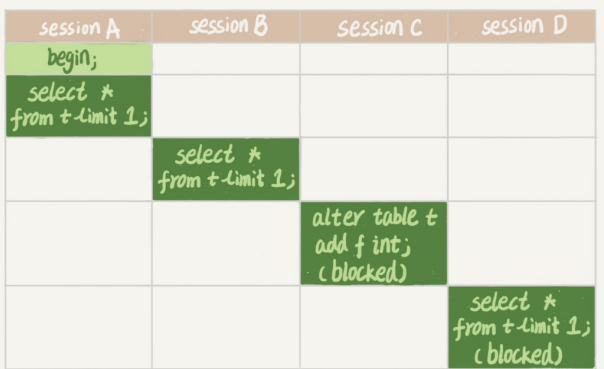
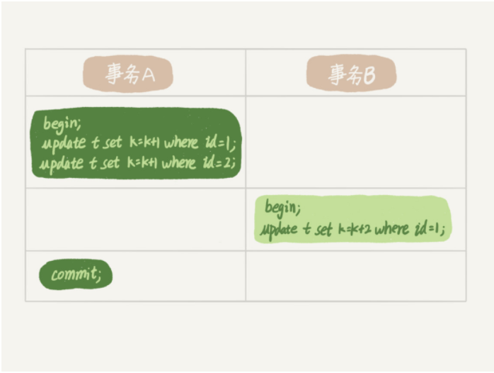

# 全局锁、表锁、行锁

mysql的锁范围：全局锁，表锁，行锁

## 全局锁
### 定义
```
让整个数据库加锁，处于只读状态。然后对于数据的DDL、DML语句和更新类事务的提交语句会产生阻塞
```
### 命令
```
FLUSH TABLE WITH READ LOCK(FTWRL)
```
### 使用场景
	全库逻辑备份
	问题点（主从同步）
	* 如果在主库做备份，那么备份期间都不能执行更新，业务基本会瘫痪
	* 如果在从库做备份，那么备份期间从库不能执行主库同步过来的binlog，导致主从延迟

官方自带逻辑备份工具：mysqldump，当mysqldump使用参数-single-transaaction的时候，导数据之前会启动一个事务，保证拿到一致性视图。在此过程中数据可以正常进行更新（引擎需要支持事务）

#### set global readonly和FTWRL的差异

* global变量的影响面大，readonly值还被用来做其他的逻辑判断
* 在异常处理机制上，FTWRL会在发生异常时断开，mysql会自动释放全局锁，整个库回到正常更新的状态，但是readonly在发生异常时，数据库会一直保持这readonly状态，但是数据库长时间不可写。

---
## 表级锁
Mysql表级锁的级别分两种：表级锁，元数据锁（MDL）

> ### 表级锁
> >* 命令
> > 	```
> > 		--锁表
> > 	​	LOCK TABLES 表名 READ/WRITE
> > 	​	--解锁
> > 	​	UNLOCK TABLES，或者客户端断开时自动释放
> > 	​	```
> > 	```
>>* 实用场景
>>      lock tables除了阻塞其他线程对锁表的读写外，也会阻塞本线程后续的操作。举个例子, 如>>果在某个线程A中执行lock tables t1 read, t2 write; 这个语句，则其他线程写t1、读 >>写t2的语句都会被阻塞。同时，线程A在执行unlock tables之前，也只能执行读t1、读写t2>>的操 作。连写t1都不允许，自然也不能访问其他表。表锁是最常用的处理并发的方式。而对于InnoDB这种支持 行锁的引擎，一般不使用lock tables命令来控制并发，毕竟锁住整个表的影响面还是太大。
---
> ### 元数据锁（MDL）
> MDL不是显示使用的，一般在访问表时会自动添加进去。作用是保证读写的正确性
> > * 解决场景
> > 		如果一个查询正在遍历一个 表中的数据，而执行期间另一个线程对这个表结构做变更，>> 删了一列，那么查询线程拿到的结果跟表结构对不上，肯定是不行的。在MySQL 5.5版本中引>> 入了MDL，当对一个表做增删改查操作的时候，加MDL读锁；当 要对表做结构变更操作的时>> >> 候，加MDL写锁。
> > ```
> > 		1.读锁之间不互斥，多个线程可以对同一张表进行读写操作
> > 		2.读与写锁之间，写锁之间互斥，用来保证变更表结构操作的安全性。因此，如果有两>> 个线程要同时给一个表加字段，其中一个要等另一个执行完才能开始执行
> > ```
> ### 场景题
> >   给一个小表加个字段，导致整个库挂了，场景如下：
> >
> >   
> >       当sessionA开启的一个读操作，加了一个读MDL，然后sessionB也需要一个MDL读锁,最后sessionC做了DDL操作，会请求一个写锁，这时候产生了互斥，导致seesionC被阻塞。若A和B存在长事务（或者操作的为热点表），C被阻塞，后续的读操作也都会被阻塞。但是数据连接池默认有retry机制，也就是说超时后会再起一个新session，再请求的话，这个库的线程很快就会爆满。
> >
> >   解决：如果是长事务影响的，MySQL的information_schema库的 innodb_trx表中，可以查到当前执行中的事务，可以暂时kill掉DDL语句，先执行DML语句后，再执行DDL语句；如果是热点表影响的，不断有新的请求过来，在alter table语句里面设定等待时间，如果在这个指定的等待时间里面能够拿到MDL写锁最好，拿不到也不要阻塞后面的业务语句，先放弃。之后开发人员或者DBA再通过重试命令重复这个过程
> >   ```
> >   MariaDB已经合并了AliSQL的这个功能，所以这两个开源分支目前都支持DDL NOWAIT/WAITn这个语法
> >   ```

## 行锁
	行锁在mysql是由引擎层的不同引擎去实现的，因为MyISAM不支持事务，故而MyISAM也没有行锁。

> InnoDB的行锁如何通过减少锁冲突来提升业务并发度

***二阶段锁***
	InnoDB是在需要的时候加上行锁，但并非是在不需要的时候释放，而是在整个事务提交完之后，才进行释放。这就是二阶段锁协议。如下：事务B的update语句会被阻塞，直到事务A执行commit之后，事务B才能继续执行。



根据此设定，如果你的事务中需要锁多个行，要把最可能造成锁冲突、最可能影响并发度的锁尽量往后放。

```
假设你负责实现一个电影票在线交易业务，顾客A要在影院B购买电影票。我们简化一点，这个业务需要涉及到以下操作：

从顾客A账户余额中扣除电影票价；

给影院B的账户余额增加这张电影票价；

记录一条交易日志。

也就是说，要完成这个交易，我们需要update两条记录，并insert一条记录。当然，为了保证交易的原子性，我们要把这三个操作放在一个事务中。那么，你会怎样安排这三个语句在事务中的顺序呢？

试想如果同时有另外一个顾客C要在影院B买票，那么这两个事务冲突的部分就是语句2了。因为它们要更新同一个影院账户的余额，需要修改同一行数据。

根据两阶段锁协议，不论你怎样安排语句顺序，所有的操作需要的行锁都是在事务提交的时候才释放的。所以，如果你把语句2安排在最后，比如按照3、1、2这样的顺序，那么影院账户余额这一行的锁时间就最少。这就最大程度地减少了事务之间的锁等待，提升了并发度。
```


**死锁和死锁检测**

​	当并发系统中不同线程出现循环资源依赖，涉及的线程都会在等待别的线程释放资源，就会导致几个线程都进入等待资源的状态，就产生了死锁（同java死锁）


解决方案：

```
1. 一种策略是，直接进入等待，直到超时。这个超时时间可以通过参数innodb_lock_wait_timeout来设置。
2. 另一种策略是，发起死锁检测，发现死锁后，主动回滚死锁链条中的某一个事务，让其他事务得以继续执行。将参数innodb_deadlock_detect设置为on，表示开启这个逻辑。
```

**热点行更新**

> 假设有1000个并发线程要同时更新同一行，那么死锁检测操作就是100万这个量级的

​		解决方案:

```
1.确保这个业务一定不会出现死锁，可以临时把死锁检测关掉
2.控制并发度
	可以考虑通过将一行改成逻辑上的多行来减少锁冲突。还是以影院账户为例，可以考虑放在多条记录上，比如10个记录，影院的账户总额等于这10个记录的值的总和。这样每次要给影院账户加金额的时候，随机选其中一条记录来加。这样每次冲突概率变成原来的1/10，可以减少锁等待个数，也就减少了死锁检测的CPU消耗。这个方案看上去是无损的，但其实这类方案需要根据业务逻辑做详细设计。如果账户余额可能会减少，比如退票逻辑，那么这时候就需要考虑当一部分行记录变成0的时候，代码要有特殊处理。
```

