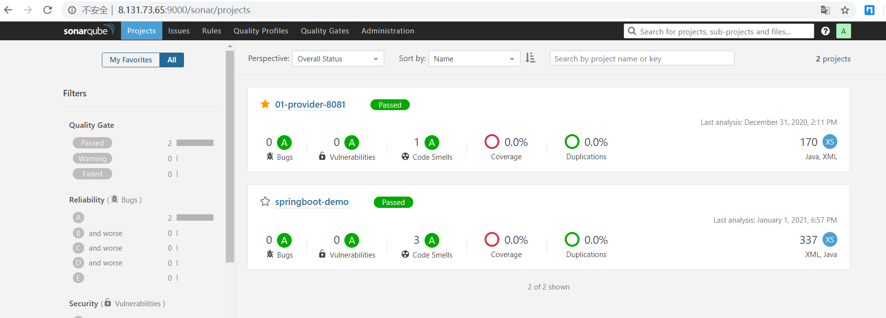

sonar安装及使用

前置依赖 

mysql 5.6 or 5.7 、jdk 1.8 

下载 

```
https://www.sonarqube.org/ 
```

安装unzip并解压sonarqube并移动到/usr/local 

```
yum install unzip 
unzip sonarqube-6.7.4.zip 
mv sonarqube-6.7.4 /usr/local/ 
```

mysql里新增数据库 

```
CREATE DATABASE sonar DEFAULT CHARACTER SET utf8; 
```

修改sonarqube相应的配置 

```
vim /usr/local/sonarqube-6.7.4/conf/sonar.properties 
#修改设置如下
sonar.jdbc.username=root  
sonar.jdbc.password=Root123.
sonar.jdbc.url=改成步骤4创建的库名 
sonar.web.context=/sonar  
sonar.web.host=0.0.0.0 
```

新增用户，并将目录所属权赋予该用户 

```
useradd sonar 
chown -R sonar:sonar sonarqube-6.7.4/ 
```

启动 

```
su sonar 
/usr/local/sonarqube-6.7.4/bin/linux-x86-64/sonar.sh start
```

访问地址

```
http://8.131.73.65:9000/sonar 
用户名/密码 admin/admin
```

在界面产生令牌， 例如输入edwin-test，产生token：e32b8c7bac49e8d7b441147eb2e6faf74d237f08


copy如下命令

```
mvn sonar:sonar \
  -Dsonar.host.url=http://8.135.14.229:9000/sonar \
  -Dsonar.login=e32b8c7bac49e8d7b441147eb2e6faf74d237f08
```

项目代码使用以下该命令进行提交由sonarqube进行分析，完成后，查看相应的分析结果

