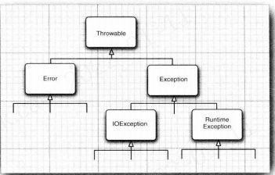

**Error** 类层次结构描述了 **Java** 运行时系统的内部错误和资源耗尽错误。 应用程序不应该抛出这种类型的对象。 如果出现了这样的内部错误， 除了通告给用户，并尽力使程序安全地终止之外， 再也无能为力了

在设计 **Java** 程序时， 需要关注 **Exception** 层次结构。 这个层次结构又分解为两个分支：一个分支派生于 **RuntimeException** ; 另一个分支包含其他异常。划分两个分支的规则是：由程序错误导致的异常属于 **RuntimeException** ; 而程序本身没有问题， 但由于像 **I**/**O** 错误这类问题导致的异常属于其他异常:

派生于 **RuntimeException** 的异常包含下面几种情况： 

* 错误的类型转换

* 数组访问越界

* 访问 **null** 指针

不是派生于 **RuntimeException** 的异常包括： 

* 试图在文件尾部后面读取数据。 

* 试图打开一个不存在的文件。 

* 试图根据给定的字符串查找 **Class** 对象， 而这个字符串表示的类并不存在

Java 语 言 规 范 将 派 生 于 Error 类 或 RuntimeException 类的所有异常称为非受查( unchecked ) 异常，所有其他的异常称为受查（ checked) 异常。

什么时候需要在方法中用 throws 子句声明异常， 什么异常必须使用 throws 子句声明：

1 ) 调用一个抛出受査异常的方法， 例如， FilelnputStream 构造器。 

2 ) 程序运行过程中发现错误， 并且利用 throw语句抛出一个受查异常（下一节将详细地介绍 throw 语句)。 

3 ) 程序出现错误， 例如，a[-l]=0 会抛出一个 ArraylndexOutOffloundsException 这样的非受查异常。

4 ) Java 虚拟机和运行时库出现的内部错误。

**RuntimeException 这个名字很容易让人混淆。 实际上，现在讨论的所有错误都发生在运行时**

**警告： 如果在子类中覆盖了超类的一个方法， 子类方法中声明的受查异常不能比超类方法中声明的异常更通用 （也就是说， 子类方法中可以抛出更特定的异常， 或者根本不抛出任何异常）。特别需要说明的是， 如果超类方法没有抛出任何受查异常， 子类也不能抛出任何受查异常。例如， 如果覆盖 JComponent.paintComponent 方法， 由于超类中这个方法没有抛出任何异常，所以， 自定义的 paintComponent 也不能抛出任何受查异常。**

在前面已经看到， 对于一个已经存在的异常类， 将其抛出非常容易

在这种情况下： 

1 ) 找到一个合适的异常类。 

2 ) 创建这个类的一个对象。 

3 ) 将对象抛出。