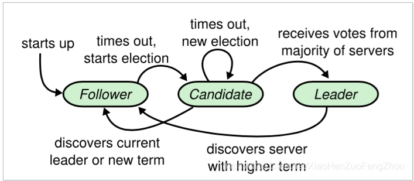
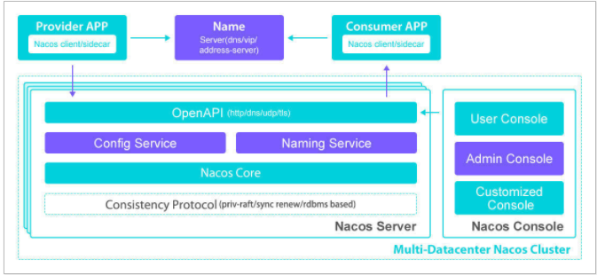
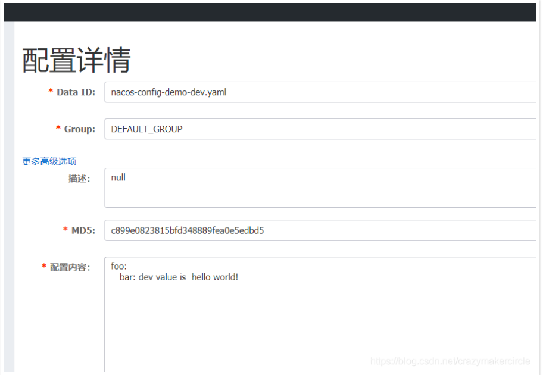
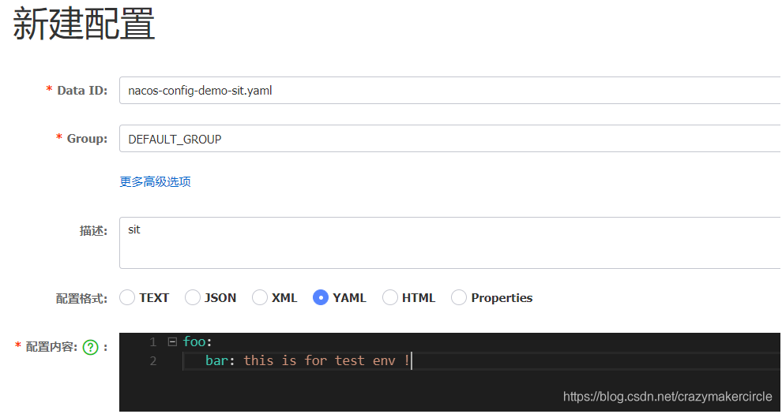
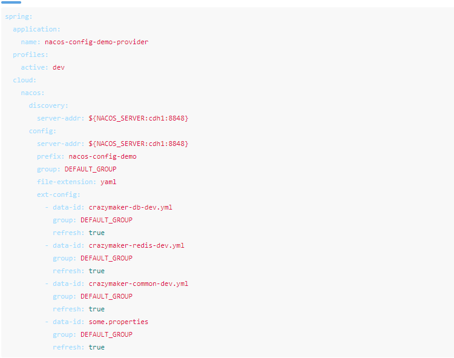

# 1、Nacos 优势

## 1.1 与 eureka 对比

> * eureka 2.0 没有开源了
> * 注册实例数多
> * 使用的raft协议，nacos集群的一致性大于eureka集群

> ### raft的数据一致性策略(2PC)

		Raft 协议强依赖 Leader 节点来确保集群数据一致性。即 client 发送过来的数据均先到达 Leader 节点，Leader 接收到数据后，先将数据标记为 uncommitted 状态，随后 Leader 开始向所有 Follower 复制数据并等待响应，在获得集群中大于 N/2 个 Follower 的已成功接收数据完毕的响应后，Leader 将数据的状态标记为 committed，随后向 client 发送数据已接收确认，在向 client 发送> > 出已数据接收后，再向所有 Follower 节点发送通知表> 明该数据状态为 committed。



## 1.2与 springcloud config 对比
> * springcloud config结合git使用，当配置文件需要动态加载时，还需要spring cloud bus消息总线来通知变化
> * config没有可视化界面
> * nacos使用长连接更新配置，通知其他生产者反应很快
---
# 2、Spring Cloud Alibaba 套件
> 目前 Spring Cloud Alibaba 主要有三个组件：
* Nacos：一个更易于构建云原生应用的动态服务发现、配置管理和服务管理平台。
* Sentinel：把流量作为切入点，从流量控制、熔断降级、系统负载保护等多个维度保护服务的稳定性。
* AliCloud OSS: 阿里云对象存储服务（Object Storage Service，简称
OSS），是阿里云提供的海量、安全、低成本、高可靠的云存储服务。您可以在任何应用、任何时> > 间、任何地点存储和访问任意类型的数据。

## Spring Cloud Alibaba 套件和 Spring Cloud Netflix 套件类比
仔细看看各组件的功能描述，Spring Cloud Alibaba 套件和 Spring Cloud Netflix 套件大致的对应关系：
```
Nacos = Eureka/Consule + Config + Admin
Sentinel = Hystrix + Dashboard + Turbine
Dubbo = Ribbon + Feign
RocketMQ = RabbitMQ
Schedulerx = Quartz
```
---
# 3、Nacos 的架构和运行

## 3.1、Nacos 的架构图



## 3.2、Nacos Server的运行
> 3.2.1两种模式
> * standalone（单例）
> * cluster（集群）
> > * 需要依赖mysql
> > * 修改配置文件
> > > conf/cluster.conf填入要运行 Nacos Server 机器的 ip
> > > 修改 NACOS_PATH/conf/application.properties，加入 MySQL 配置(不支持mysql8.0)
```
standalone 的话仅会使用 Derby，即使在 application.properties 里边配置 MySQL 也照样无视；
cluster 模式会自动使用 MySQL，这时候如果没有 MySQL 的配置，是会报错的
```

> 3.2.2启动方式
> sh bin/startup.sh -m standalone
> cmd bin/startup.cmd -m standalone

> 3.2.3 配置数据存储位置
> * 内存
> * 本地数据库


## 3.3、Nacos Client的使用
	与eureka大同小异
---
# 4、Nacos作为配置中心

## 4.1 基本概念
### 1、profile
	Java 项目一般都会有多个 Profile 配置，用于区分开发环境，测试环境，准生产环境，生成环境等，每个环境对应一个 properties 文件（或是 yml/yaml 文件），然后通过设置 spring.profiles.active 的值来决定使用哪个配置文件。
### 2、Data ID
	当使用 Nacos Config 后，Profile 的配置就存储到 Data ID 下，即一个 Profile 对应一个 Data ID
```
	prefix 默认为 spring.application.name 的值，也可以通过配置项 spring.cloud.nacos.config.prefix 来配置
	spring.profiles.active 取 spring.profiles.active 的值，即为当前环境对应的 profile
	file-extension 为配置内容的数据格式，可以通过配置项 spring.cloud.nacos.config.file-extension 来配置
```
### 3、Group
	Group 默认为 DEFAULT_GROUP，可以通过 spring.cloud.nacos.config.group 来配置，当配置项太多或者有重名时，可以通过分组来方便管理最后就和原来使用 springcloud 一样通过@RefreshScope 和 @Value 注解即可

## 4.2 通过 Nacos 的 console 去增加配置
* nacos-config-demo-dev.yaml 开发环境的配置
	


	
* nacos-config-demo-test.yaml 测试环境的配置

 

## 4.3 客户端如何与服务端的配置文件相互对应
* config.prefix 来对应主配置文件
* 使用 spring.cloud.nacos.config.ext-config 选项来对应更多的文件


---

# 5、配置隔离
1、开发环境、测试环境、准生产环境和生产环境需要隔离
2、不同项目需要隔离
3、同一项目，不同的模块需要隔离
隔离使用方法：Nacos 的服务器、namespace 命名空间、group 分组